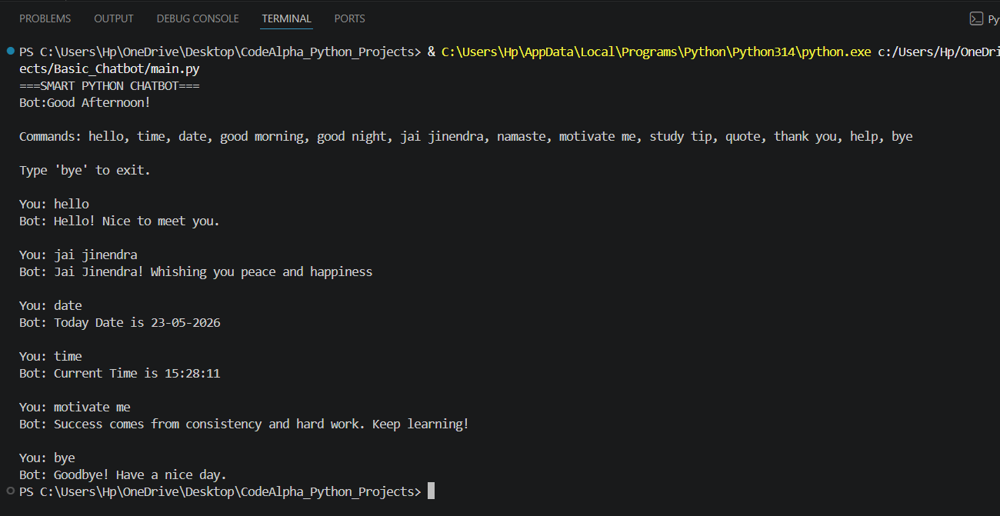

# Smart Python Chatbot

A simple interactive chatbot developed using Python that responds to greetings, time, date, motivation, and basic user queries.

---

## Features

- Greeting system
- Time and date response
- Motivation and study tips
- Interactive conversation
- Simple rule-based chatbot

---

## Technologies Used

- Python
- Datetime Module

---

## Project Structure

```text
Basic_Chatbot/

│
├── main.py
├── chatbot_output.png
└── README.md
```

---

## How to Run

```bash
python main.py
```

---

## Output



---

## Sample Output

```text
You: hello
Bot: Hello! Nice to meet you.

You: time
Bot: Current Time is 10:45:20

You: bye
Bot: Goodbye! Have a nice day.
```

---

## Concepts Used

- if-elif conditions
- functions
- loops
- input/output
- string handling

---

## Author

Priyanshi Jain

---

## Internship

CodeAlpha Python Programming Internship
