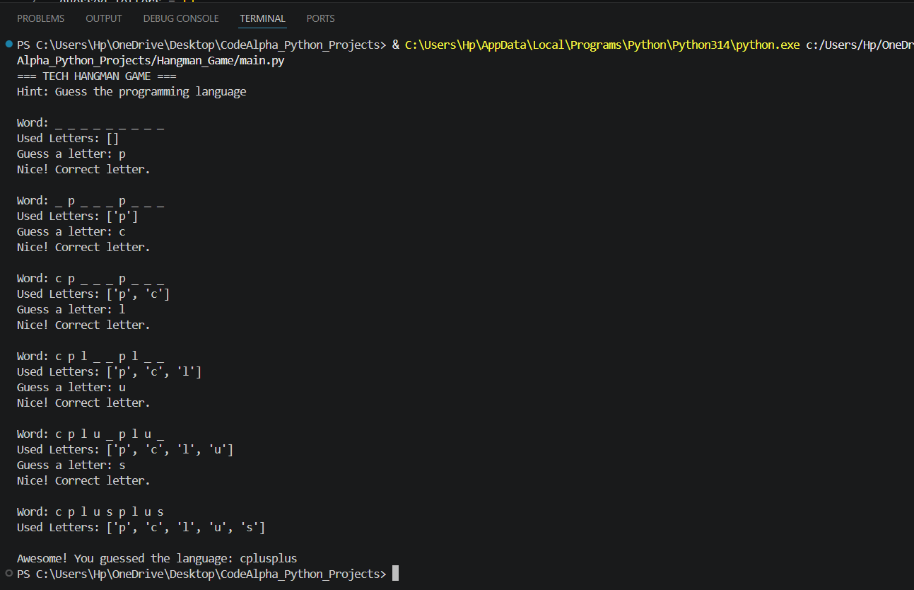

# Tech Hangman Game

A simple Python-based Hangman game where players guess hidden programming language names letter by letter.

---

## Features

- Random word selection
- Attempt tracking
- Input validation
- Interactive gameplay
- Win and lose conditions

---

## Technologies Used

- Python
- Random Module

---

## Project Structure

```text
Hangman_Game/

│
├── main.py
├── hangman_output.png
└── README.md
```

---

## How to Run

```bash
python main.py
```

---

## Output



---

## Sample Output

```text
=== TECH HANGMAN GAME ===

Word: _ _ _ _ _ _

Guess a letter: p

Nice! Correct letter.
```

---

## Concepts Used

- loops
- conditional statements
- lists
- string handling
- random module
- input/output

---

## Author

Priyanshi Jain

---

## Internship

CodeAlpha Python Programming Internship
