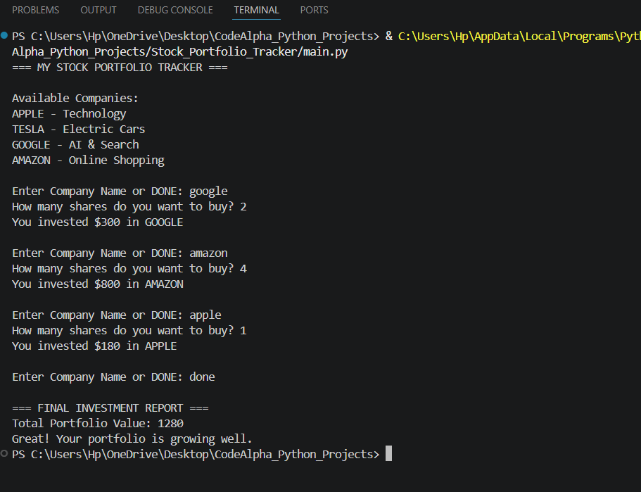

# Stock Portfolio Tracker

A Python project that calculates stock investments and tracks total portfolio value based on selected company shares.

---

## Features

- Investment calculator
- Portfolio value tracking
- Company-wise investment summary
- User-friendly terminal interface
- Simple stock management system

---

## Technologies Used

- Python

---

## Project Structure

```text
Stock_Portfolio_Tracker/

│
├── main.py
├── portfolio_output.png
├── portfolio_report.txt
└── README.md
```

---

## How to Run

```bash
python main.py
```

---

## Output



---

## Sample Output

```text
=== MY STOCK PORTFOLIO TRACKER ===

Enter Company Name or DONE: APPLE

How many shares do you want to buy? 5

You invested $900 in APPLE

=== FINAL INVESTMENT REPORT ===

Total Portfolio Value: 900
```

---

## Concepts Used

- dictionaries
- loops
- conditional statements
- arithmetic operations
- input/output
- string handling

---

## Author

Priyanshi Jain

---

## Internship

CodeAlpha Python Programming Internship
