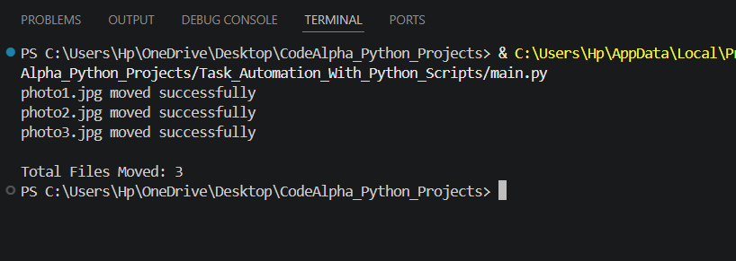

# Task Automation With Python Scripts

A Python automation project that automatically moves JPG image files from one folder to another folder.

---

## Features

- Automatic JPG file movement
- File organization system
- Folder management
- Error handling
- Automated repetitive task handling

---

## Technologies Used

- Python
- OS Module
- Shutil Module

---

## Project Structure

```text
Task_Automation_With_Python_Scripts/

│
├── source_images/
├── organized_images/
├── automation_output.png
├── main.py
└── README.md
```

---

## How to Run

```bash
python main.py
```

---

## Output



---

## Sample Output

```text
sample_photo1.jpg moved successfully
sample_photo2.jpg moved successfully

Total Files Moved: 2
```

---

## Concepts Used

- file handling
- os module
- shutil module
- loops
- conditional statements
- automation scripting

---

## Author

Priyanshi Jain

---

## Internship

CodeAlpha Python Programming Internship
